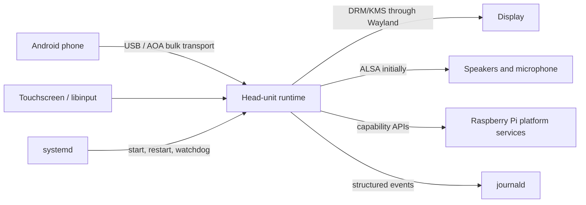
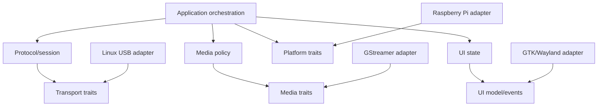
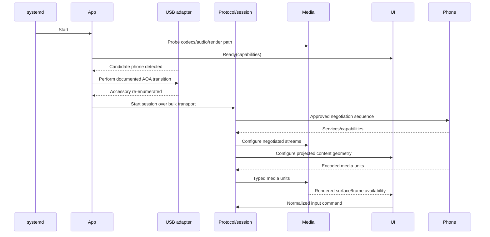

# Architecture

## 1. Architectural stance

The initial product is a **modular monolith**: one supervised native runtime composed of strongly separated Rust crates, plus small diagnostic/configuration commands from the same workspace. This gives clear ownership and test boundaries without introducing inter-process frame transfer, duplicated lifecycle logic, or a collection of services during the highest-risk protocol phase.

The design allows a component to move behind IPC later, but no process split is introduced until isolation or independent lifecycle needs justify its cost.

## 2. Context

## 3. Internal dependency rule

Dependencies point inward toward domain contracts:

Rules:

- `protocol` has no dependency on GTK, GStreamer, udev, board model, or systemd.
- `media` consumes typed encoded/audio units and session policy; it does not parse protocol messages.
- `ui-model` contains view state and input commands without GTK types.
- `platform-api` defines capabilities and operations; Raspberry Pi/Linux code implements them.
- The application layer wires components through bounded channels and owns cancellation/reconnect policy.
- Adapters may depend on system libraries; domain crates do not.

## 4. Proposed components

### `transport-api`

Traits and value types for device discovery, connection, ordered frame read/write, cancellation, and transport errors. It must not mention Android Auto channel semantics.

### `transport-usb`

Linux/libusb implementation for discovery, AOA identification/transition, re-enumeration, interface claim, bulk endpoints, hot unplug, and permissions diagnostics. The documented AOA control phase is P0. Android Auto-specific accessory strings and subsequent framing require separate provenance.

### `protocol`

Message framing, channel identifiers, serialization, validation limits, and protocol errors. Generated definitions, if any, live in a visibly provenance-tracked submodule/crate with source and license metadata. Unknown fields are preserved or rejected according to a written rule; they are never guessed.

### `session`

An explicit state machine for discovery, version/security negotiation, service discovery, channel setup, running, draining, and teardown. Each transition records its allowed inputs, timeout, cancellation behavior, and user-visible failure category.

The state machine is transport-independent and tested against scripted peers. Cryptographic handshakes are implemented only from an approved source and use a maintained TLS library.

### `media-api` and `media-gstreamer`

`media-api` defines encoded-video input, audio stream roles, microphone source, focus policy, clocks, backpressure, and capability reporting. `media-gstreamer` builds pipelines selected from probed capabilities rather than board-name conditionals.

Preferred video pipeline characteristics:

1. Parse the negotiated compressed stream.
2. Prefer a usable V4L2 decoder for the negotiated codec.
3. Keep decoded buffers in zero-copy-capable memory where the driver/sink combination supports it.
4. Use GPU composition through the Wayland/DRM stack.
5. Fall back to an optimized software decoder with GPU composition and reduce negotiated resolution/frame rate if required.

No particular GStreamer element name is part of the architecture contract. The capability probe records decoder, formats, buffer modes, sink, measured latency, and failure reason.

Pi 4/CM4 officially advertise H.264 hardware decode. Pi 5/CM5 officially advertise HEVC hardware decode, not H.264 hardware decode. If the phone supplies H.264 on Pi 5/CM5, the planned safe fallback is software H.264 decode plus GPU composition unless testing demonstrates a maintained hardware path or approved protocol negotiation permits HEVC.

Audio uses separate logical roles (media, navigation/system, speech, microphone), a common monotonic clock, bounded jitter buffers, and explicit focus/ducking policy. ALSA is the initial appliance backend because it has a predictable boot/runtime model. PipeWire is a later adapter for coexistence with the Raspberry Pi desktop. Deprecated AOA 2.0 USB audio mode is not used as the Android Auto audio implementation.

### `ui-model` and `ui-gtk`

GTK 4 is the proposed native shell because it has mature Linux touch/Wayland integration and maintained Rust bindings. The UI is deliberately thin: ready/connecting/consent/error states, projected video surface, transient status controls, diagnostics, and safe power controls.

Touch events are normalized in `ui-model`, transformed using the negotiated content rectangle, and sent as typed input events. Rotation, letterboxing, scaling, and calibration are applied exactly once. UI code does not serialize protocol messages.

GTK/GStreamer integration, render-buffer sharing, and 720p/1080p latency must pass an on-device architecture spike before this choice is locked in. If it fails, the replacement must still implement the same `ui-model` and media contracts.

### `platform-api`, `platform-linux`, and `platform-rpi`

Principal contracts:

- `HardwareInventory`: immutable board, kernel, device, and carrier-visible inventory.
- `CapabilityProbe`: display, renderer, codec, audio, microphone, input, USB topology, and network capabilities.
- `PowerControl`: narrowly scoped restart/shutdown request.
- `DisplayControl`: brightness/blanking/rotation capabilities where safely available.
- `NetworkControl`: absent from wired v1 behavior but reserved for the wireless milestone.
- `HealthReporter`: component liveness and degraded-state reporting.

`platform-linux` handles standard DRM, evdev/libinput, ALSA, sysfs, and udev behavior. `platform-rpi` adds SoC/device-tree interpretation and known Raspberry Pi quirks. CM carrier variations are configuration/capability facts, not new board subclasses.

Wireless discovery is capability-based. It queries kernel/udev inventory plus NetworkManager and BlueZ over their supported interfaces. It reports Wi-Fi and Bluetooth independently as:

- `Absent`: no matching onboard radio/function is exposed;
- `Ready`: hardware, driver, firmware, and management service are usable;
- `Disabled`: present but administratively disabled or rfkill-blocked;
- `Degraded`: present but unavailable because of a driver, firmware, regulatory-domain, antenna/configuration, or service error.

The probe records whether an interface is onboard or external. Module model strings are supporting diagnostics only, because CM4 and CM5 have both wireless and non-wireless variants.

Provider selection is explicit and deterministic:

1. Use a `Ready` onboard provider for each capability by default.
2. If onboard Wi-Fi or Bluetooth is `Absent`, select a compatible `Ready` USB provider for that missing capability.
3. Do not silently bypass onboard hardware that is merely `Disabled` or `Degraded`; explain the fault and allow configuration to choose a USB fallback.
4. Permit mixed arrangements such as onboard Wi-Fi with USB Bluetooth.
5. Persist selection by stable physical USB port path plus adapter identity, not transient interface names such as `wlan1` or `hci1`.

An adapter compatibility record states chipset/USB identity, in-kernel driver, required firmware package, AP/client capabilities, Bluetooth version/features, tested Raspberry Pi OS release, power requirement, and test status. “Linux detected it” is not sufficient evidence for wireless Android Auto support.

The settings UI exposes two independent provider selectors:

- **Wi-Fi:** `Auto`, `Onboard`, or a named supported USB Wi-Fi adapter.
- **Bluetooth:** `Auto`, `Onboard`, or a named supported USB Bluetooth adapter.

`Auto` prefers a `Ready` onboard provider and otherwise selects a `Ready` supported USB provider. A manual selection is never silently replaced: if it disappears or fails, the UI explains the problem and wireless Android Auto remains off until the provider returns or the user changes the setting. Wired Android Auto is unaffected. Diagnostics show both the configured choice and effective provider.

### Carrier profiles

A carrier profile describes physical integration without leaking it into session or media logic:

- USB host controller/port path, hub topology, phone-port power switching, and current budget;
- HDMI/DSI connector and display defaults;
- touchscreen identity, rotation, and calibration;
- ALSA output/input identities and amplifier/mute GPIOs;
- ignition, safe-shutdown, fan, brightness, and status GPIOs;
- antenna selection/placement expectations and enclosure constraints;
- module compatibility and required Device Tree overlays.

Profiles are schema-versioned data with small, reviewed platform hooks only where data is insufficient. Detection can use Device Tree compatibility, an optional carrier EEPROM/identity, and explicit administrator selection. It must not guess a carrier from a coincidental USB device.

The initial carrier profile is the user's exact Waveshare model/revision once identified. The production target is a fabrication-neutral custom carrier design supporting both CM4 and CM5 through the documented common subset and deliberate handling of differences. Raspberry Pi documents that the modules share a form factor and that cross-generation IO-board use has reduced functionality, so the PCB must be verified against both datasheets and the CM4-to-CM5 transition guide rather than assuming full pin equivalence.

The first concrete carrier profile is `waveshare-cm4-io-base-b-rev3.1`. Its validation must cover the onboard FE1.1S USB 2.0 hub/ports, optional USB FFC expansion, M.2 NVMe path, 15-pin DSI connector, HDMI outputs, RTC, fan controller, and 5 V power budget. It is a CM4 profile, not evidence that the same board fully supports CM5.

Display profiles describe discovery/matching and defaults, not hard-coded UI sizes. The first is the original official 7-inch DSI Touch Display at 800 × 480. The renderer always works from the actual mode and touch coordinate space, so a later larger thin-bezel HDMI/USB-touch or DSI display does not require protocol changes.

### `network-api`, `network-networkmanager`, and `bluetooth-bluez` (post-wired release)

The future wireless transport uses NetworkManager and BlueZ adapters behind narrow traits. Bluetooth discovery/pairing/bootstrap and the Wi-Fi data link remain separate state machines. The implementation must test onboard and supported USB radios for AP/client mode, regulatory domain, reconnect, suspend, USB hot-unplug, and Wi-Fi/Bluetooth coexistence. Wireless Android Auto handshake details remain PX until backed by an approved source; ordinary hotspot support does not prove Android Auto wireless compatibility.

### `app`

Owns the top-level lifecycle, cancellation tree, bounded queues, retry budget, backoff, error classification, and transition of the UI model. Only one phone session is active in v1. Multiple detected phones produce a deterministic selection/error state rather than racing.

### `diagnostics`

Read-only preflight and support-bundle generation. The default support bundle includes versions, capabilities, redacted state transitions, and recent errors. It excludes payloads, media, device serials, contacts, destinations, and raw session capture.

## 5. Runtime sequence

The sequence deliberately leaves the post-AOA negotiation abstract until its provenance is approved.

## 6. Concurrency and backpressure

- One cancellation token tree spans device, session, and each media channel.
- Control messages use a small lossless bounded queue; saturation is a session fault.
- Video uses a bounded queue that may discard superseded non-key frames according to decoder-safe policy; it must never grow without limit.
- Audio uses bounded time-based buffers. Overflow/underflow is measured; stale audio is not allowed to accumulate indefinitely.
- UI state is latest-value/watch semantics; transient commands are bounded.
- Blocking libusb/GStreamer callbacks are isolated from async control tasks.
- No lock is held across a library callback or await boundary.

Exact queue sizes are measured configuration, not hard-coded architecture assumptions.

## 7. Error and recovery model

Errors are classified as:

- `UserAction`: unlock phone, accept consent, replace cable.
- `Unsupported`: phone/protocol/codec/configuration not supported.
- `Transient`: device disappeared, timeout, audio device briefly unavailable.
- `Configuration`: permissions, missing display/audio/input, invalid settings.
- `ProtocolViolation`: malformed, oversized, invalid-state, or unsupported required message.
- `Internal`: invariant failure or adapter bug.

Transient errors return to discovery with capped exponential backoff. Protocol violations close only the current session and preserve a redacted reason. Repeated internal failures allow systemd restart; retry storms are rate-limited.

## 8. Security boundary

- A dedicated `aa-headunit` user owns runtime state.
- Device access is granted with narrow udev rules and required groups/ACLs; no general `sudo` access.
- Systemd hardening is applied incrementally and verified against DRM/USB/audio needs (`NoNewPrivileges`, private temporary storage, protected system/home, restricted namespaces/address families/capabilities where compatible).
- Power actions go through a narrow polkit/system helper boundary; the main process never accepts arbitrary commands.
- Configuration is schema-validated and read from `/etc/aa-headunit/`; mutable state is in `/var/lib/aa-headunit/`.
- Logs go to journald with structured, redacted fields.

## 9. Deployment model

The release package installs one main executable, optional diagnostic/configuration command entry points, assets, default configuration, udev rules, and systemd units. Appliance mode runs a minimal Wayland compositor/session dedicated to the UI; desktop mode is a development/convenience profile, not the boot-performance reference.

The service remains disabled until preflight confirms a display, input device, writable state directory, USB access, and at least one audio output. Enabling the service is explicit and reversible.

## 9.1 Development topology

The recommended workflow is hybrid:

- Windows 11 is the editing, documentation, and source-control workstation.
- The Pi 5 8 GB with NVMe is the primary native `arm64` build/run target, accessed over SSH.
- Pi 4 and CM4/Waveshare systems are physical compatibility runners.
- VNC/screen sharing is optional for later UI inspection; it is unnecessary for the first headless diagnostic milestone.
- CI still performs host-independent tests and package builds, but native Pi tests remain authoritative for USB, media, display, audio, and radio behavior.

Native Pi builds are preferred initially because GTK, GStreamer, libusb, udev, ALSA, NetworkManager, and BlueZ must link and behave against the exact Raspberry Pi OS libraries. Cross-compilation can be added later for faster feedback, but it does not replace native execution.

## 10. Testing architecture

- Pure unit tests: state machines, parsers, geometry transforms, audio focus, configuration, retry policy.
- Property/fuzz tests: frame decoding, generated message decoding, channel routing, touch transforms.
- Contract tests: every adapter against fake and real capability providers.
- Scripted peer tests: deterministic session cases without a phone.
- Golden tests: only for non-sensitive, synthetic fixtures with recorded provenance.
- On-device integration: USB re-enumeration, decode/render, audio loopback, touch, hot unplug.
- Hardware matrix: Pi 4, CM4 carrier, Pi 5, CM5 carrier; at least one low-memory SKU per SoC family before 1.0.
- Phone matrix: pinned Android OS, Android Auto app version, manufacturer/model, USB mode, expected result.
- Package tests: clean install, upgrade, remove, purge, service enable/disable, no-network startup.

Real-phone tests are not assumed suitable for public cloud CI. They run on maintained physical runners and publish redacted results.

## 11. Architecture decisions to record before implementation expands

- ADR-0001: modular monolith and crate boundaries.
- ADR-0002: protocol provenance and project license.
- ADR-0003: GTK 4/GStreamer acceptance or replacement after spike.
- ADR-0004: Trixie-only initial baseline.
- ADR-0005: ALSA appliance backend and optional PipeWire adapter.
- ADR-0006: system service, dedicated user, and minimal compositor/session model.
- ADR-0007: configuration schema/versioning.
- ADR-0008: carrier-profile identity and custom CM4/CM5 common hardware contract.
- ADR-0009: onboard wireless capability detection and NetworkManager/BlueZ ownership.

## 12. Reference facts

- Google documents AOA USB connection for DHU 2.x: https://developer.android.com/training/cars/testing/dhu
- AOA 2.0 audio mode is deprecated from Android 8: https://source.android.com/docs/core/interaction/accessories/aoa2
- Raspberry Pi OS moved from legacy MMAL/OpenMAX toward standard V4L2 and PipeWire-era interfaces: https://pip.raspberrypi.com/categories/685-whitepapers-app-notes-compliance-guides/documents/RP-006519-WP/Transitioning-from-Bullseye-to-Bookworm.pdf
- Pi 4 H.264 capability: https://www.raspberrypi.com/products/raspberry-pi-4-model-b/specifications/
- Pi 5 HEVC capability: https://www.raspberrypi.com/products/raspberry-pi-5/
